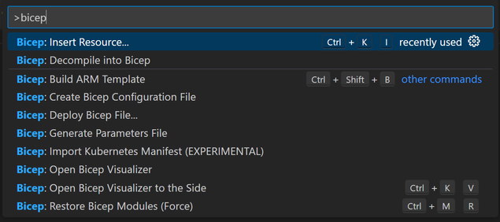

# Setting your tools up
  
## Installing VSCode

Visual Studio Code, or VSCode, is the main [IDE](https://en.wikipedia.org/wiki/Integrated_development_environment) (Integrated development environment) used for developing bicep resources. It is open source, and available for all major platforms.

Install it by going to [the VSCode webpage](https://code.visualstudio.com/) and downloading it for your preferred operating system.

### Extensions

One of VSCodes main features is the extensions system. There are tools developed for just about anything you can imagine.

Install an extension is done by clicking the `Extensions` button in VSCode

In order for VSCode to work with bicep files we recommend installing the following plugins.

- [Bicep](https://marketplace.visualstudio.com/items?itemName=ms-azuretools.vscode-bicep), by Microsoft

- [Azure Account](https://marketplace.visualstudio.com/items?itemName=ms-vscode.azure-account), by Microsoft

### Bicep extension commands

The Bicep extension in VSCode comes with a number of built in commands. You can find them all by clicking:

**Windows:**
> `F1`, or `CTRL + Shift + P` `(macOS: Cmd⌘ + Shift + P)`, or `View -> Command palette`

**MacOS:**
> `F1`, or `Commdand⌘ + Shift + P)`, or `View -> Command palette`

Once you have opened the command palette you type `bicep` to see all available commands.

## Azure PowerShell modules and az cli

Apart from VSCode you may also use CLI tools to work with bicep.
These tools are available as a PowerShell module, or an extension to the az cli (azure command line interface).

Functionality may differ, for example, the PowerShell module may in some cases need to you to manually install Bicep CLI.

You can find installation methods for these tools here

[Azure CLI + bicep extension](https://learn.microsoft.com/en-gb/azure/azure-resource-manager/bicep/install#azure-cli)

[Azure PowerShell](https://learn.microsoft.com/en-us/powershell/azure/install-az-ps?view=azps-9.3.0)

[Manually installing the Bicep CLI](https://learn.microsoft.com/en-gb/azure/azure-resource-manager/bicep/install#install-manually)

## More information

[Bicep tools at MS Learn](https://learn.microsoft.com/en-gb/azure/azure-resource-manager/bicep/install)