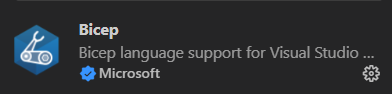
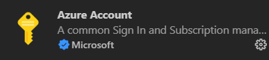

# Setting your tools up
  
## Installing VSCode

Visual studio code, or VSCode, is the main [IDE](https://en.wikipedia.org/wiki/Integrated_development_environment) (Integrated development environment) used for developing bicep resources. It is open source, and available for all major platforms.

Install it by going to [the VSCode webpage](https://code.visualstudio.com/) and downloading it for your preferred operating system.

### Plugins

One of VSCodes main features is the plugin system. There are tools developed for just about anything you can imagine.

Installing a plugin is done by clicking the `Extensions` button in VSCode

In order for VSCode to work with bicep files we recommend installing the following plugins.

- Bicep, by Microsoft

TODO: Stefan - Behöver man denna för att köra `Insert resource`?
- Azure Account, by Microsoft

## Azure PowerShell modules and az cli

Apart from VSCode you may also use CLI tools to work with bicep.
These tools are available as a PowerShell module, or an extension to the az cli (azure command line interface).

Functionality may differ, for example, the PowerShell module may in some cases need to you to manually install bicep CLI.

You can find installation methods for these tools here

[Azure cli bicep extension](https://learn.microsoft.com/en-gb/azure/azure-resource-manager/bicep/install#azure-cli)

[Azure PowerShell](https://learn.microsoft.com/en-us/powershell/azure/install-az-ps?view=azps-9.3.0)

[Manually installing the bicep CLI](https://learn.microsoft.com/en-gb/azure/azure-resource-manager/bicep/install#install-manually)