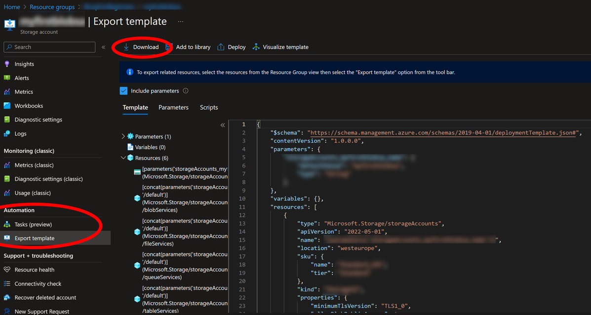
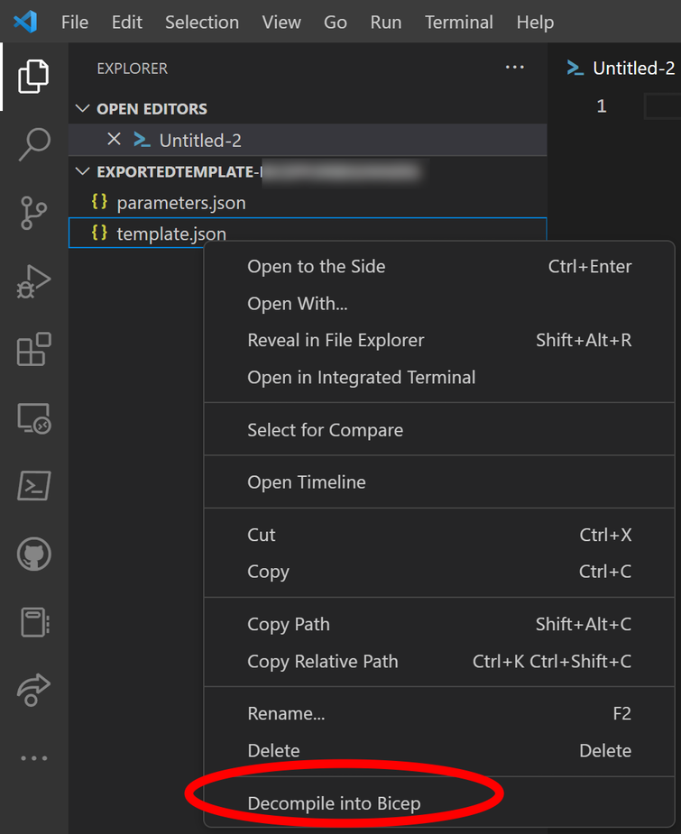
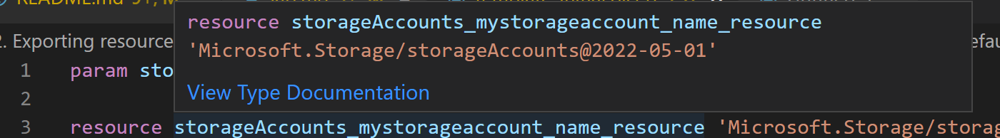
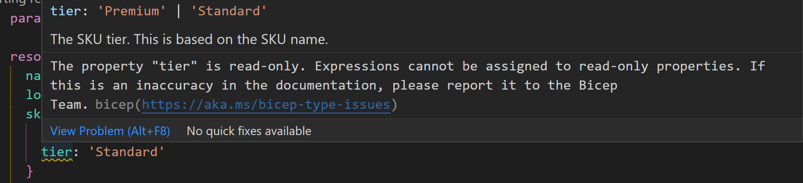
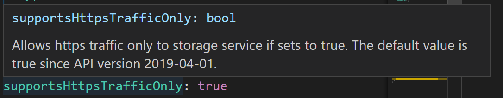
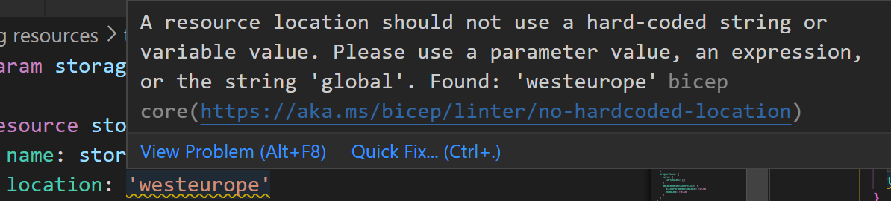

# Exporting resources

There are many different ways to get started creating Bicep templates.
In this lab we will look at different ways to use the Azure portal to help us create a bicep resource.

In order to do this we will need access to an Azure account with a connected subscription. If you do not have one you can sign up for a free evaluation account with 200$ credit [here](https://azure.microsoft.com/en-us/free/).

## Creating a storage account in Azure

In many cases you will already have resources in Azure that have been created without the use of Infrastructure as Code(IaC). Maybe you lift and shifted servers from On-Premises, or you used the Azure Portal to test different services. In this lab we will simulate this scenario by first creating an Azure storage account in our Azure subscription using the portal.

> Note: The recommended settings here are _NOT_ for production use. The setup is primarily for easy access and low cost lab. Production workloads may require higher levels of security, faster access, and better redundancy options.

- Log in to the Azure Portal using a web browser, [https://portal.azure.com/](https://portal.azure.com/)
- Select `Create a resource`
- In the marketplace, search for `Storage account`, and select the `storage account`resource by Microsoft from the list
- Click `Create`
- Recommended settings for our lab are
  - Basics
    - Create a new resource group
    - Specify a globally unique name for your storage account
    - Choose a region close to you, for example 'West Europe' or 'Sweden Central'
    - Performance: Standard
    - Redundancy: Locally-redundant storage (LRS)
  - Advanced
    - Require secure transfer for REST API operations
    - Access tier: Hot
  - Networking
    - Network access: Enable public access from all networks
  - Data protection
    - Uncheck all soft delete checkboxes.
- Click `Create`

## Exporting the resource to Visual Studio Code

Once you have a resource set up in Azure there are a number of ways of retrieving it to your bicep template.

### Using the VSCode bicep extension

> **NOTE:** At the time of this writing there is [a bug in the VSCode extension](https://github.com/Azure/bicep/issues/9241) that causes this to not work in some cases. If this case doesn't work, please continue to the next lab.

The Bicep extension for VSCode includes the `Insert resource` command. You can use this to directly export a resource from your Azure environment to your VSCode session.

To do this you need to know the resource id of the resource you want to export. You can get this id through the portal, using Azure PowerShell, or as described here, using the Azure CLI.

- If not already open, open the console in VSCode by clicking `Ctrl+ö (Windows)`, `Control⌃ + Shift⇧ +´(macOS)`, or `View -> terminal`

**Azure CLI:**
- Run the command `az login` to connect to your azure subscription
- Run the command `az resource show --resource-type "Microsoft.Storage/storageAccounts" -g "<your resource group>" -n "<Name of your storage account>" --query 'id'`

> Tip: you can pipe the output of this command directly to your clipboard by adding "`| clip`" to the end of the command on windows.

>Note: If you have access to multiple subscriptions you need to select the subscription you want to work with using: `az account set --subscription <subscription id>`

**Azure PowerShell:**
- Run the command `Connect-AzAccount` to connect to your azure subscription
- Run the command `(Get-AzResource -ResourceGroupName "<your resource group>" -Name "<Name of your storage account>").ResourceId`

> Tip: you can pipe the output of this command directly to your clipboard by adding "`| Set-Clipboard`" to the end of the command on windows.

>Note: If you have access to multiple subscriptions you need to select the subscription you want to work with using: `Select-AzAccount -SubscriptionId <subscription id>`

Once you have found the id of your resource you can insert it to your VSCode session.

- Open the Command palette in VSCode as described in [lab number 1](../1.%20Setting%20up%20your%20resources/lab.md)
- In the search window, type `Insert resource`
- Paste, or type, the resource id of the resource to import _without quotation marks_

> **Note:** The bicep extension uses a strict order of account credentials to authenticate to Azure. If you have problems authenticating to azure try closing and re-opening VSCode, and _only_ authenticate using Azure CLI `az login` or Azure PowerShell `Connect-AzAccount`. The default behavior in Bicep is to pick the authentcation token from Azure CLI first, then if not found use the token from Azure PowerShell. This is configurable using a `bicepconfig.json` file.

### Using Azure portal export

Another way of exporting a template is the export functionality in Azure.

- Find your resource blade in the [Azure portal](https://portal.azure.com)
- In the left menu tree under the `Automation` headline, go to `Export template`
- Click the `Download` button to save a zip file containing your template and parameters file to your computer
- Extract the downloaded zip file



Start working with your template in VSCode
- Open a new VSCode window by clicking `File -> New window`
- Open your downloaded template folder by clicking `File -> Open folder`, browse to, and select your folder.
- In the explorer sidebar, right click `template.json` and select `Decompile into Bicep`. This will add a new file to your folder named `template.bicep`

> **Note:** If no explorer sidebar is visible, you can open it by clicking the icon with two pages seen below, or click `View -> Explorer`, Or `Ctrl+Shift+E (Windows)`, or `Shift+Command+E (macOS)`



## Creating a template in the portal

It is also possible to create a base template in the Azure portal _without_ creating the actual resource. The process is similar to `Using Azure portal export`, yet requires a couple of extra steps.

- In the [Azure portal](https://portal.azure.com), click `Create a resource`
- Search the marketplace for `storage account`and select `Create` on the `Storage account` app from Microsoft.
- Use the settings from `Creating a storage account in Azure`, but after `Validation`, do _NOT_ click the `Create` button. Instead, click the `Download a template for automation` link.
- In the `template` window, click `Download`
- Continue from step 4 in `Using Azure portal export` - "Extract the downloaded zip file"

## Cleaning up an exported or created resource

While exporting resources is a great way to start, In many cases you get a lot more in your templates than needed. The configurations may also not always be as flexible or reusable as you want them.

This lab will look at some ways to simplify your templates and make them easier to reuse.

You can find the initial templates, and the end results, in the subfolder named `templates`

### General clean-up

Lots of the data you get from an exported template is actually the default values of properties, and not necessary to set unless you want to change those values.

Finding allowed and default values can be done in multiple ways, and there will be many keys and values to remove outside of the two examples provided. Try to clean as much as possible before looking at the result template.

#### Using the documentation

- Hover your mouse over the _name_ of the resource you're interested in to get help on.
- Click the `View Type Documentation` link to open the online documentation in your default browser.



> Hint: Make sure the `Bicep` button is highlighted in the `Choose a deployment language` box to get the correct help documentation.

In [the documentation for the storage account resource type](https://learn.microsoft.com/en-gb/azure/templates/microsoft.storage/storageaccounts?tabs=bicep&pivots=deployment-language-bicep#storageaccountpropertiescreateparametersorstorageaccountproperties) we can see that the value for `allowBlobPublicAccess` is default set to `true`. Since the value in our template is the same, and this is not a mandatory parameter we can remove this setting completely.

We can also see that the `Sku` array contains a `tier` key, but [no such key is listed in the documentation](https://learn.microsoft.com/en-gb/azure/templates/microsoft.storage/storageaccounts?tabs=bicep&pivots=deployment-language-bicep#sku). Hovering over the _yellow squiggly_ line tells us that this is a read only property and we can safely remove it.



#### Using VSCode built in documentation

You can in many cases also get property information by using the built in VSCode functionality.

- Hovering over the `SupportsHTTPSTrafficOnly` key gives us the same information [found in the documentation](https://learn.microsoft.com/en-gb/azure/templates/microsoft.storage/storageaccounts?tabs=bicep&pivots=deployment-language-bicep#storageaccountpropertiescreateparametersorstorageaccountproperties). Since we are working with API version `2022-05-01` we can safely remove this setting.



### Using parameters

#### Location

In order to make the template easier to reuse there are some values that the export hard coded that you will want to have as parameters. One such example is the `Location` parameter. Use the `Quick fix` function to automatically fix this.

- In the hover window, click the `Quick Fix...` button to automatically create a parameter and set the values correct.



#### Container name

In our template we have one container set up. The export hard coded this container name as `mycontainer`.

In order to make the template reusable, change the template so the end user can set this value.

- Create a parameter in the top of the bicep file named `containerName` and with the type `string`
- Replace the value of the `name` key in the `containers` resource with the parameter
- Since no default value is given to this parameter, add it as a parameter with a default value in the parameters file.

```Bicep
// Only changed or added values are displayed here
param containerName string
// ----
name: containerName
// ----
```

#### Storage account SKU

Some values may have a list of possible values where we want to allow users to select one, yet restrict the input to predefined values. Create a parameter for the Storage account SKU that allows you to set any possible value in the parameter file.

- Create a new parameter called `storageAccountSku` of type `string`
- Set the value of the Storage accounts `sku` `name` key to this parameter
- Use the [`@allowed`](https://learn.microsoft.com/en-us/azure/azure-resource-manager/bicep/parameters#allowed-values) decorator to only allow input of [available SKUs](https://learn.microsoft.com/en-gb/azure/templates/microsoft.storage/storageaccounts?tabs=bicep&pivots=deployment-language-bicep#sku)

```Bicep
// Only changed or added values are displayed here
@allowed([
  'Premium_LRS'
  'Premium_ZRS'
  'Standard_GRS'
  'Standard_GZRS'
  'Standard_LRS'
  'Standard_RAGRS'
  'Standard_RAGZRS'
  'Standard_ZRS' 
])
param storageAccountSku string 
// ----
name: containerName
// ----
```

### Using Variables

When deploying templates we often construct properties based on input. For example we may want to use [Azure naming conventions](https://learn.microsoft.com/en-us/azure/cloud-adoption-framework/ready/azure-best-practices/resource-naming#example-names-general) based on the name parameter.

Use variables to standardize the name of your storage account using a name parameter and a variable.

- Add a parameter called `baseName` as a required parameter. For ease of use, give it a good description using the [`@description` decorator](https://learn.microsoft.com/en-us/azure/azure-resource-manager/bicep/parameters#description). Remember to add it to the parameter file as well.
- Add a variable called `saName` following the [storage account naming convention](https://learn.microsoft.com/en-us/azure/cloud-adoption-framework/ready/azure-best-practices/resource-naming#example-names-storage) using string interpolation.
- Set the value of the Storage accounts `name` key to this parameter
- Remove the now unused parameter from the template and the parameter file.

```Bicep
// Only changed or added values are displayed here
@description('This name will be the base of which all other resources will be calculated')
param baseName string
// ----
var saName = 'sa${baseName}'
// ----
name: saName
// ----
```

### Using Functions

Some resources have special requirements for parameter values, such as:

- Storage account name must be globally unique
- Storage account name must be between 3-24 characters, and only contain lower case characters and numbers

Using [bicep functions](https://learn.microsoft.com/en-us/azure/azure-resource-manager/bicep/bicep-functions), create a new variable for the storage account name that will enforce both of the above mentioned rules.

- Create a new variable called `unique`
- use the [`uniqueString`](https://learn.microsoft.com/en-us/azure/azure-resource-manager/bicep/bicep-functions-string#uniquestring) function and use the [`resourceGroup`](https://learn.microsoft.com/en-us/azure/azure-resource-manager/bicep/bicep-functions-scope#resourcegroup) function as parameter to create a globally unique string
- Create a new variable called `globalyUniqueSAName` that:
  - Joins the `unique` variable with the `saName` variable using string interpolation
  - Uses the [`take`](https://learn.microsoft.com/en-us/azure/azure-resource-manager/bicep/bicep-functions-array#take) function to make sure the maximum length of the string is 24 characters
- Replace the value of the Storage accounts `name` key to use the `globalyUniqueSAName` parameter

```Bicep
// Only changed or added values are displayed here
var unique = uniqueString(resourceGroup().name)
var globalyUniqueSAName = take('${unique}${saName}', 24)
// ----
name: globalyUniqueSAName
```
