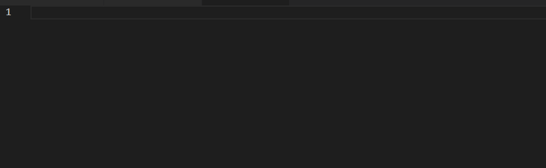
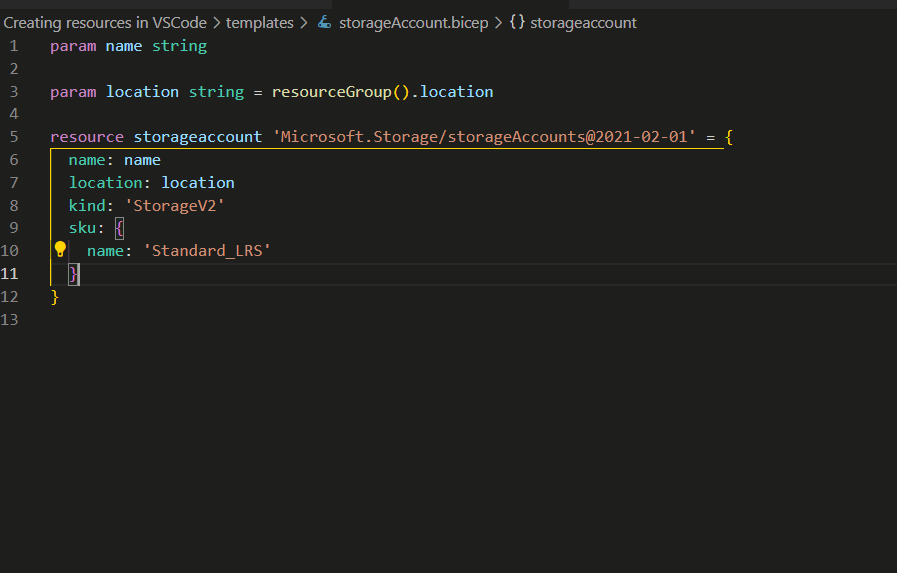
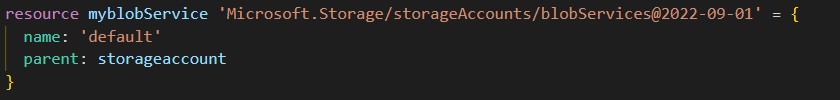
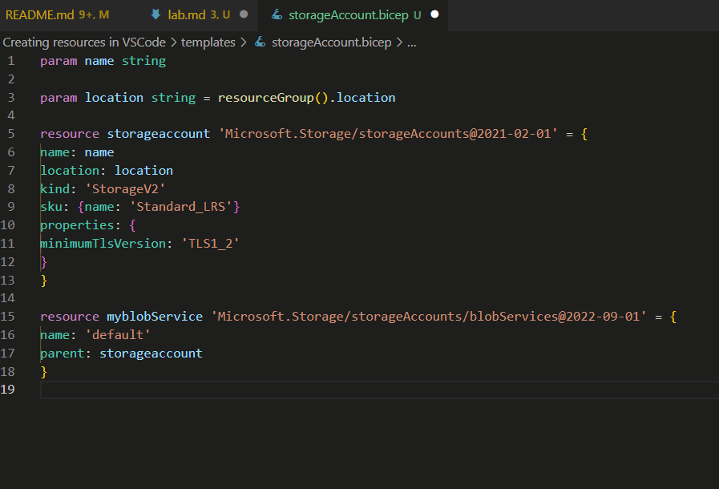
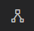
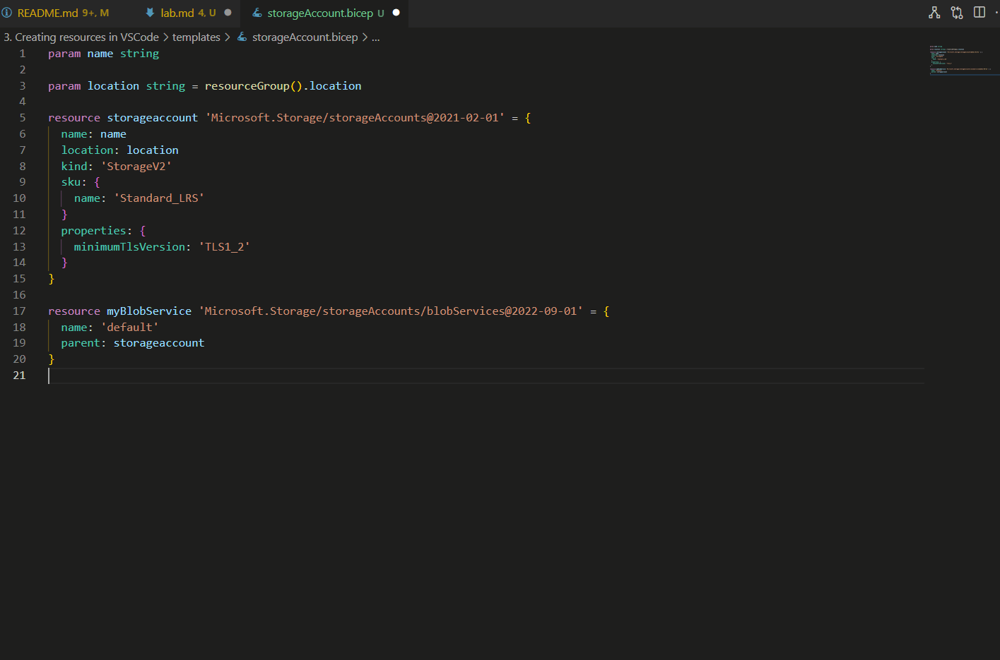

# Creating resources in Visual Studio Code

Creating resources from scratch in VSCode may be the best way to get resources configured the way you want, while also having them maintainable. After all, no one writes code as good as you do!

There are a number of tools built in to the bicep extension that helps you create and set everything up the way you want, for example:

- Snippets
- Short commands
- Formatting
- Visualizer
- Parameter file generating

You can find most of them by opening the Command palette (`view -> Command palette`, `Ctrl+Shift+P`, `(macOS: Cmd⌘ + Shift + P)` or `F1`), or using IntelliSense (`Ctrl+Space`)

> Hint: VSCode also comes with a number of built in keyboard shortcuts that helps you write code. You can get a list of them for your system by clicking `Help -> Keyboard shortcuts reference` or `Ctrl+K -> Ctrl+R`, `(macOS: Cmd+K -> Cmd+R)`

## Creating a storage account using Visual Studio Code snippets

Use the built-in snippets to create a `Storage account` resource with the required properties

- Open a new tab in VSCode (`Ctrl+N`, `(macOS: Cmd⌘+N)`) and use the command palette to set the language mode to `Bicep`. Alternatively create a new file with the `.bicep` file extension.
- In the code window, type `res` to get a list of resource snippets. Continue to type, or scroll down and select the `res-storage` snippet



- Create a parameter for the `Name` key. It should be mandatory input when deploying the template.
- Create a parameter for the `Location` key. It should use the `resourceGroup().location` function as default to deploy to the same location as the resource group.

## IntelliSense

In many cases IntelliSense is automatically triggered and will let you know what possible values you can use in this position.
If it doesn't start automatically, In almost any location of a template you can start IntelliSense by clicking `Ctrl+Space` to see what keywords, keys, or values, are accepted in the current location.

Use IntelliSense to find all values possible in the `sku -> name` key, and change it to use Standard Locally Redundant Storage.

- Remove the `'Premium_LRS'` value
- If IntelliSense does not start automatically, click `Ctrl+Space` to start it
- Select `'Standard_LRS'` from the drop down.

Use `Ctrl+Space` to make sure the storage account only accepts TLS1.2

- On a new line in the Storage account resource, click `Ctrl+Space`
- Select `Properties` from the drop down
- select `{}` indicating properties is a list
- start typing `tls` to get a list of possible keys, and select `minimumTlsVersion` from the drop down
- click `Ctrl+Space` and select `TLS1_2` from the drop down



### Required Properties

IntelliSense can even help you create your resources from scratch much like snippets.

Use the `required properties` function to create a `blobService` resource, and set it as a child of your storage account

- on the start of a line type `resource` to create a new resource. Give the resource a name, `myBlobService`, and select the `Microsoft.Storage/storageAccounts/blobServices@2022-09-01` resource type and API version.
- Type `=` after the API version.
- If IntelliSense does not automatically start, use `Ctrl+Space` to start it, and select `required-properties` from the drop down list
- Give the blob service a name of ['default'](https://learn.microsoft.com/en-us/azure/azure-resource-manager/bicep/child-resource-name-type) (case sensitive)
- On a new line, click `Ctrl+Space` and select `parent` from the drop down
- Set the `parent` value to the [symbolic name](https://learn.microsoft.com/en-us/azure/azure-resource-manager/bicep/resource-declaration?tabs=azure-powershell#declaration) of your storage account resource



## Formatting

Before moving on we should make sure your code is formatted in an easy readable and standardized way. Fortunately VSCode has built in tools for this as well.

Simply open the Command palette, and search for `format document`, or click `Shift+Alt+F`, (`macOS: Shift+Option+F`)



## Visualizer

So far we created two resources: A parent, the storage account, and a child, the blob service. We can see the relationship between these using the VSCode visualizer. Open it by clicking the visualizer button in the top right corner of your VSCode template window, clicking `Ctrl+K -> V`, `macOS:Cmd+K -> V` or opening the command palette and search for `bicep: visualizer`



Open the visualizer to the side, Add another resource of the type `containers`, give it a name of `'default'` and set it as a child resource of `myBlobService`. The visualizer will update the relationship right away.

- Open the visualizer
- Insert the code below in your template

```Bicep
resource myblobContainerService 'Microsoft.Storage/storageAccounts/blobServices/containers@2022-09-01' = {
  name: 'default'
  parent: myBlobService
}
```



## Parameter file generating

Once the template is done we should have a matching parameter file to go with it. Once again VSCode contains built in functionality to make this easier for us.

- Right click your template in the file explorer of VSCode and select `Generate parameters file`

This will generate a parameters file with all your required parameters in the same folder as the template. If a parameter has a default value it will not be included in the parameters file, but has to be added afterwards.
